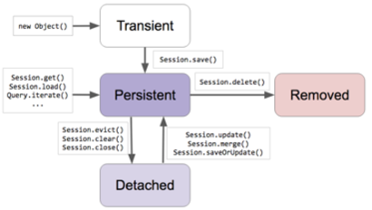
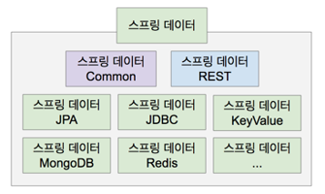
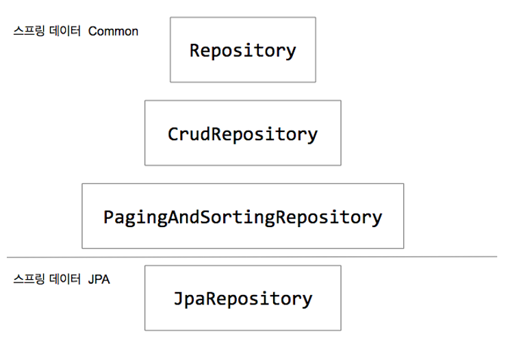
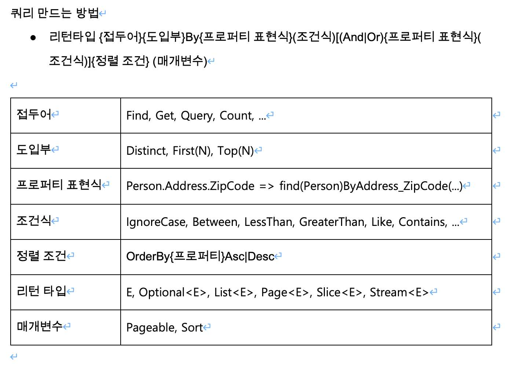

# [인프런 - 스프링 데이터 JPA](https://www.inflearn.com/course/%EC%8A%A4%ED%94%84%EB%A7%81-%EB%8D%B0%EC%9D%B4%ED%84%B0-jpa)를 보고 정리한 내용입니다

* [1. ORM 개요](#1-orm-개요)
* [2. JPA 프로그래밍 : 프로젝트 세팅](#2-jpa-프로그래밍--프로젝트-세팅)
* [3. JPA 프로그래밍 : 엔티티 맵핑](#3-jpa-프로그래밍--엔티티-맵핑)
* [4. JPA 프로그래밍 : Value 타입 맵핑](#4-jpa-프로그래밍--value-타입-맵핑)
* [5. JPA 프로그래밍 : 1대다 맵핑](#5-jpa-프로그래밍--1대다-맵핑)
* [6. JPA 프로그래밍: Cascade](#6-jpa-프로그래밍-cascade)
* [7. JPA 프로그래밍 : Fetch](#7-jpa-프로그래밍--fetch)
* [8. JPA 프로그래밍 : Query](#8-jpa-프로그래밍--query)
* [9. 스프링 데이터 JPA 소개 및 원리](#9-스프링-데이터-jpa-소개-및-원리)
* [10. 스프링 데이터 JPA 활용 파트 소개](#10-스프링-데이터-jpa-활용-파트-소개)
* [11. 스프링 데이터 JPA Common 1. 리포지토리](#11-스프링-데이터-jpa-common-1-리포지토리)
* [12. 스프링 데이터 JPA Common 2. 인터페이스 정의하기](#12-스프링-데이터-jpa-common-2-인터페이스-정의하기)
* [13. JPA Test 관련](#13-jpa-test-관련)
* [14. 스프링 데이터 Common: Null 처리하기](#14-스프링-데이터-common-null-처리하기)
* [15. 스프링 데이터 Common 4. 쿼리 만들기 / 쿼리 만들기 실습](#15-스프링-데이터-common-4-쿼리-만들기--쿼리-만들기-실습)
* [16. 스프링 데이터 Common: 커스텀 리포지토리](#16-스프링-데이터-Common-커스텀-리포지토리)
* [17. 스프링 데이터 Common: 커스텀 리포지토리 커스터마이징](#17-스프링-데이터-Common-커스텀-리포지토리-커스터마이징)

## 1. ORM 개요

ORM은 애플리케이션의 클래스와 SQL 데이터베이스의 테이블 사이의 **맵핑 정보를 기술한 메타데이터**를 사용하여, 자바 애플리케이션의 객체를 SQL 데이터베이스의 테이블에 **자동으로 (또 깨끗하게) 영속화** 해주는 기술입니다.
In a nutshell, object/relational mapping is the automated (and transparent) persistence of objects in a Java application to the tables in an SQL database, using metadata that describes the mapping between the classes of the application and the schema of the SQL database.

> Java Persistence with Hibernate, Second Edition

* 맵핑정보
  * 클래스 - 테이블
  * 필드 - 컬럼

## 2. JPA 프로그래밍 : 프로젝트 세팅

* JPA의 핵심은 EntityManager
* EntityManager 내부에서 hibernate를 사용하기 때문에 JPA 기반 / hibernate 기반 둘 다 사용가능하다.
* Spring Data JPA를 사용하면 EntityManager을 직접 사용할 일이 없다.
* Spring Boot에서 hibernate 관련 의존성이 들어오면 HibernateJpaAutoConfiguration에 있는 자동 설정이 진행된다.
* EntityManager는 Spring Boot 자동설정에 의해 EntityManagerFactoryBuilder가 Bean으로 등록되어있기 때문에 Bean으로 주입받아서 사용 가능하다.

### 2-1. 프로젝트 세팅

#### 2-1-1. application.properties

```properties
spring.datasource.url=jdbc:postgresql://localhost:5432/springdata
spring.datasource.username=jihun
spring.datasource.password=pass

spring.jpa.hibernate.ddl-auto=create
```

* spring.jpa.hibernate.ddl-auto
  * db 초기화 전략이다.
    * none : 아무것도 실행하지 않는다.
    * create : SessionFactory가 시작될 때 데이터베이스 drop을 실행하고 생성된 DDL을 실행한다
    * create-drop : SessionFactory가 시작될 때 drop및 생성을 실행하고, SessionFactory가 종료될 때 drop을 실행한다
    * validate : Entity와 Relation과 스키마 정보를 비교해서 일치하지 않으면 Application이 실행되지 않는다.
    * update : Entity가 변경되면, 변경사항을 추가한다. Entity의 멤버변수가 삭제되어도, Relation의 Column은 삭제되지 않으며, Entity의 멤버변수 이름이 변경되어도 Relation의 Column의 이름은 변경되지 않고 새로운 Column이 생성된다.

#### 2-1-2. Account.java

Entity 클래스이다.

```java
@Entity
@Getter
@Setter
public class Account {

  @Id
  @GeneratedValue
  private long id;

  private String username;

  private String password;
}
```

#### 2-2-2. JpaRunner.java

* Spring Boot 실행시 JPA를 테스트 해보기 위한 클래스이다.
* @PersistenceContext를 사용해서 EntityManager를 주입받는다.  
* EntityManager를 통해 영속화(Persistence)할 수 있다.
* EntityManager와 관련된 모든 작업은 한 트랜젝션 안에서 일어나야 한다.
* Hibernate의 가장 핵심 API는 Session이다.
* EntityManager 내부에서 hibernate를 사용하기 때문에 JPA 기반 / hibernate 모두 사용해서 영속화를 진행하였다.

```java
@Component
@Transactional
public class JpaRunner implements ApplicationRunner {

  @PersistenceContext
  EntityManager entityManager;

  @Override
  public void run(ApplicationArguments args) throws Exception {
  Account account = new Account();
  account.setUsername("jihun");
  account.setPassword("hibernate");

  //hibernate
  Session session = entityManager.unwrap(Session.class);
  session.save(account);

  //jpa
  //entityManager.persist(account);
  }
}
```

## 참고자료

* [JPA, Hibernate, 그리고 Spring Data JPA의 차이점](https://suhwan.dev/2019/02/24/jpa-vs-hibernate-vs-spring-data-jpa/)

## 3. JPA 프로그래밍 : 엔티티 맵핑

Domain 모델을 relation에 어떻게 매핑시킬시 정보(맵핑 정보를 기술한 메타데이터)를 줘야하는데, 해당 정보를 설정하는 방법은 어노테이션 또는 xml을 사용하는 방법이 존재하며, 많이 사용하는 방법은 어노테이션 기반이다.

### 3-1. Entity mapping

#### 3-1-1. @Entity

* Domain 클래스가 Entity라는 것을 표현
* Entity는 객체 세상에서 부르는 이름
* Entity는 자동으로 relation으로 매핑 된다.
* @Entity에 name 속성을 사용해서 이름을 부여할 수 있다.
  * name 속성은 기본적으로는 클래스의 이름을 사용한다.
  * @Table의 name 속성에 따로 이름을 지정하지 않으면 relation 이름은 @Entity의 이름을 따라간다.

아래 예제에서 Account라는 Table이 DB에 생성된다.

```java
@Entity
public class Account {}
```

#### 3-1-2. @Table

* relation 세상에서 부르는 이름
* @Entity의 이름이 기본값이다.
* 아래 코드에서 relation의 이름은 Account가 아닌 user가 된다.

```java
@Entity
@Table(name = "user")
public class Account {}
```

#### 3-1-3. @Id

* Entity의 Primary Key를 mapping 할 때 사용
* 자바의 모든 primitive type과 wrapper type 모두 사용 가능하다.

```java
@Entity
public class Account {

    @Id
    private long id;
}
```

### 3-1-4. @GeneratedValue

* Primary Key의 생성방법을 mapping 하는 어노테이션
* strategy 속성을 사용해서 생성 전략과 생성기를 설정할 수 있다.
* 옵션을 정의하지 않을 경우 기본값은 AUTO이며 DB에 따라 생성전략이 달라진다.
  * 생성전략으로 AUTO, TABLE, SEQUENCE, IDENTITY가 있다.
    * AUTO : Primark Key 생성을 DB에 위임 한다. DB에 따라서 TABLE, SEQUENCE, IDENTITY 중 하나를 자동으로 선택한다.
    * TABLE : 키 생성 테이블을 생성해서 사용한다.
    * SEQUENCE : DB의 Sequence 사용
    * IDENTITY : Primary Key 생성을 DB에 위임한다.

```java
@Entity
public class Account {
  
  @Id
  @GeneratedValue
  private long id;
}
```

#### 3-1-5. @Column

* 모든 Entity에 있는 멤버변수에는 @Column이 붙어있다.
* @Column에는 다양한 속성이 있다. name, unique, nullable 등....

```java
@Entity
public class Account {
  
  @Id
  @GeneratedValue
  private long id;

  @Column(name = "user_name", unique = true, nullable = false)
  private String username;
}
```

#### 3-1-6. @Temporal

* Column에 날짜 및 시간을 어떻게 저장할지 설정
* JPA 2.1까지은 Date와 Calendar만 지원
* JPA 2.2부터 JDK 8에 추가된 LocalDateTime, LocalDate 등 을 지원
  * hibernate 5.3부터 JPA 2.2를 지원한다. - [Hibernate 5.3 release](http://hibernate.org/orm/releases/5.3/
  )
  * @Temporal는 Date와 Calander만 지원한다!!!

```java
@Entity
public class Account {
  
  @Id
  @GeneratedValue
  private long id;

  @Temporal(TemporalType.TIMESTAMP)
  private Date createDate = new Date();
}
```

* LocalDate와 LocalDateTime은 @Temporal를 사용하지 않고 그냥 아래처럼 사용하면 된다! 단 JPA 2.2 부터 지원!

```java
@Entity
@Getter
public class Account {

  @Id
  @GeneratedValue
  private long id;

  private String username;

  private String password;

  private LocalDateTime createDate = LocalDateTime.now();
}
```

#### 3-1-7. @Transient

* 해당 멤버변수를 Column으로 매핑하지 않는다.

```java
@Entity
public class Account {

  @Id
  @GeneratedValue
  private long id;

  @Transient
  private String dummy;
}
```

### 3-2. 쿼리 출력관련 설정

* spring.jpa.show-sql=true
  * 쿼리 출력
* spring.jpa.properties.hibernate.format_sql=true
  * 쿼리를 보기 좋게 출력
* logging.level.org.hibernate.SQL=debug
  * 쿼리 출력으로 spring.jpa.show-sql와 logging.level.org.hibernate.SQL 중 하나 사용하면 된다.
* logging.level.org.hibernate.type.descriptor.sql=trace
  * 쿼리 ? 값 출력

## 4. JPA 프로그래밍 : Value 타입 맵핑

### 4-1. Entity 타입이란

* 아래 조건을 만족하면 Entity 타입이다.
  * 고유한 식별자를 가지고 있다. 예를들어 Primary Key
  * 독립적으로 존재하는가? 다른 Entity에서 독립적으로 참조 가능한가?

### 4-2. value 타입이란

* Entity를 통해서 접근가능한 것들
* Value Type 종류
  * primitive Type(String, Date, Boolean, ...)
  * Composite Value Type
    * primitive Type 보다 조금 더 큰 단위의 Value Type 이다.
  * Collection Value Type

#### 4-2-1. Composite Value Type

* primitive Type 보다 조금 더 큰 단위의 Value Type 이다.
* Composite Value Type에는 클래스에 @Embeddable 어노테이션을 사용해서 해당 클래스가 Composite Value 임을 지정한다.
* Entity 클래스에서는 @Embedded 어노테이션을 사용해서 Composite Value를 사용할 수 있다.
* Composite Value가 사용된 Entity 클래스에서는 @AttributeOverrides 어노테이션과 @AttributeOverride을 사용해서 Composite Value에 정의된 값을 오버라이딩 해서 재정의 할 수 있다.

#### 4-2-1-1. Address

Composite Value 클래스로 `@Embeddable` 가 사용된 것을 알 수 있다.

```java
@Embeddable
public class Address {

  private String street;
  private String city;
  private String state;
  private String zipCode;
}

```

#### 4-2-1-2. Account

* Entity 이다.
* Composite Value에 @Embedded 가 사용된 것을 알 수 있다.
* @AttributeOverrides와 @AttributeOverride 를 사용해서 Composite Value에 정의된 값을 오버라이딩 해서 재정의 한 것을 알 수 있다.

```java
@Entity
public class Account {

  @Id
  @GeneratedValue
  private long id;

  @Embedded
  private Address homeAddress;

  @Embedded
  @AttributeOverrides({
    @AttributeOverride(name = "street", column = @Column(name = "company_streat")),
    @AttributeOverride(name = "city", column = @Column(name = "company_city")),
    @AttributeOverride(name = "state", column = @Column(name = "company_state")),
    @AttributeOverride(name = "zipCode", column = @Column(name = "company_zipcode"))
  })

  private Address companyAddress;

}
```

## 5. JPA 프로그래밍 : 1대다 맵핑

* 두 개의 Entity에서 하나는 관계의 주인(owning)이며, 하나는 종속된(non-owning) 쪽이다.
* 관계에서 주인(owning)은 반대쪽 래퍼런스 쪽을 가지고 있는 쪽이다.
  * 예를들어 Account(Study를 만든사람)와 Study(스터디)와의 관계는?
    1. Study가 owning / Account가 non-owning 일 때
        * Study는 하나의 Account를 가질 수 있다.
        * Study에서 Account Reference를 가지고 있기 때문에 Study과 주인이고, Account가 종속된 쪽이다.
    2. Account가 owning / Study가 non-owning 일 때
        * Account는 여러개의 Study를 가질 수 있다.
        * Account에서 Study Reference를 가지고 있기 때문에 Account가 주인이고, Study가 종속된 쪽이다.

### 5-1. 단방향 Mapping

#### 5-1-1. @ManyToOne

* owner에서 non-owning를 하나만 가질 때 사용
  * 예를들어 Study에서 하나의 Account를 가질 때
* 기본 mapping 방법은 owner에 정의된 non_owning field의 변수이름에_id를 붙여서 FK를 생성
  * 아래 코드에서는 owner에 정의된 non_owing field의 이름이 owner이기 때문에 owner_id라는 FK가 생성된다.

```java
@Entity
@Getter
@Setter
public class Study {

    @Id
    @GeneratedValue
    private Long id;

    private String name;

    @ManyToOne
    private Account owner;

}
```

#### 5-1-2. @OneToMany

* owner에서 non-owning를 여러개 가질 때 사용
  * 예를들어 Account에서 여러개의 Study를 가질 때
* 기본 mapping 방법은 관계에 대한 정보를 가진 Join Table을 생성
  * Join table 이름은 `owner Entity 이름_Entity에 정의되어 있는 non-owning의 이름` 으로 생성된다.
    * 아래코드에서는 Entity의 이름이 Account이고, Entity에 정의되어 있는 non-owning의 이름이 studies이기 때문에 Join Table의 이름은 account_studies가 된다.

```java
@Entity
@Getter
@Setter
public class Account {

    @Id
    @GeneratedValue
    private long id;

    @OneToMany
    private Set<Study> studies = new HashSet<>();
}
```

> Mapping시 @ManyToOne을 쓸지 @OneToMany를 쓸지 헷갈린다면, 뒤에 One과 Many로 판단! owner에서 non-owning를 하나만 가진다면 One! 이며 여러개를 가지면 Many!

### 5-2. 양방향 Mapping

* 양방향 관계로 만들려면 @OneToMany에 `mapperBy 속성`을 사용해서 이 관계가 owner에 어떻게 mapping이 되어 있는지 관계를 정의한 필드를 명시해 줘야한다.
  * 양방향 Mapping에서는 기본적으로 FK를 가진 쪽이 owner이기 때문에 non-owning인 Account에 mappedBy 속성을 사용해서 owner에 어떻게 mapping 되어있는지 설정해 줬다.
  > mapperBy 속성은 @OneToMany에 밖에 없다.

```java
@Entity
@Getter
@Setter
public class Study {

  @Id
  @GeneratedValue
  private Long id;

  private String name;

  @ManyToOne
  private Account owner;

}

@Entity
@Getter
@Setter
public class Account {

  @Id
  @GeneratedValue
  private long id;

  @OneToMany(mappedBy = "owner")
  private Set<Study> studies = new HashSet<>();
}
```

* 양방향일때 관계를 설정하는 코드가 들어가는데 해당 코드들은 보통 convinience method로 묶어서 관계에 한쪽에 넣어서 사용한다.

```java
@Component
@Transactional
public class Runner implements ApplicationRunner {

    @PersistenceContext
    EntityManager entityManager;

    @Override
    public void run(ApplicationArguments args) throws Exception {


        Account account = new Account();
        account.setName("jihun");

        Study jpaStudy = new Study();
        jpaStudy.setStudyName("jpaStudy");
        //관계 설정
        jpaStudy.setOwner(account);

        Study springBootStudy = new Study();
        springBootStudy.setStudyName("springBootStudy");
        //관계 설정
        springBootStudy.setOwner(account);

        //관계 설정
        account.getStudy().add(jpaStudy);
        account.getStudy().add(springBootStudy);
    }
}
```

* convinience method 추가
  * Account에 convinience method를 추가하였으며, Runner에서 해당 메서드를 사용해서 관계를 설정해 주었다. Runner 클래스의 run 메서드에 관계를 설정하는 코드가 4줄에서 2줄로 줄어든 것을 볼 수 있다.

```java
@Entity
@Getter
@Setter
public class Account {

  @Id
  @GeneratedValue
    private long id;

  @OneToMany(mappedBy = "owner")
    private Set<Study> studies = new HashSet<>();

    public void addStudy(Study study){
        this.getStudies().add(study);
        study.setOwner(this);
    }
}

@Component
@Transactional
public class Runner implements ApplicationRunner {

    @PersistenceContext
    EntityManager entityManager;

    @Override
    public void run(ApplicationArguments args) throws Exception {


        Account account = new Account();
        account.setName("jihun");

        Study jpaStudy = new Study();
        jpaStudy.setStudyName("jpaStudy");

        Study springBootStudy = new Study();
        springBootStudy.setStudyName("springBootStudy");

        //관계 설정
        account.addStudy(jpaStudy);
        account.addStudy(springBootStudy);
    }
}
```

## 6. JPA 프로그래밍: Cascade

### 6-1. Cascade 옵션

* Entity의 상태변화를 전파시키는 옵션
  * 예를들어 A Entity의 상태가 Transient에서 Persistent로 변할 때 B Entity의 생태도 Transient에서 Persistent로 변하게 하는 옵션
* @OneToMany, @ManyToOne에 cascade 옵션 존재
* 기본적으로 cascade 옵션은 아무것도 없음

### 6-2. Entity의 상태란



#### 6-2-1. Transient

* JPA가 해당 객체에 대해 모르는 상태
* DB에 mapping 되어 있는 레코드도 전혀 없음.
* 현재 해당 객체는 DB에 들어갈지 안들어갈지 모르는 상태

#### 6-2-2. Persistent

* JPA가 관리중인 상태
* save 한다고 해서 바로 DB에 값이 저장되는 것이 아니다.
  * Persistent로 관리하고 있다가 특정 시점(특정시점은 트랜잭션이 끝날 떄)에 데이터를 저장
* Persistent에서는 여러가지 일을 해줌

#### 6-2-2-1. 1차 캐시

* PersistentContext에 해당 인스턴스를 보관

아래 예제에서 로직상으로 보면 `account` 와 `study`가 DB에 저장된 후 select 쿼리가 발생할 것 같지만 실제로 select 쿼리는 발생하지 않으며, `account` 와 `study` 도 트랜젝션이 끝난 뒤에 insert 되며, `session.load(Account.class, account.getId()` 는 select 쿼리가 발생하시 않고 PersistentContext에 캐시되어 있는 값을 가져온다.

```java
@Component
@Transactional
public class JpaRunner implements ApplicationRunner {

    @PersistenceContext
    EntityManager entityManager;

    @Override
    public void run(ApplicationArguments args) throws Exception {

        Account account = new Account();
        account.setUsername("jihun");
        account.setPassword("jpa");

        Study study = new Study();
        study.setName("Spring Data JPA");

        account.addStudy(study);

        Session session = entityManager.unwrap(Session.class);
        session.save(account);
        session.save(study);

        Account jihun = session.load(Account.class, account.getId());
        System.out.println("====================");
        System.out.println(jihun.getUsername());
    }
}
```

#### 6-2-2-2. Dirty Checking과 Write Behind

* Dirty Checking은 객체의 변경사항을 계속 감지
* Write Behind 객체 상태의 변화를 DB에 최대한 늦게 적용한다는 개념
* Dirthy Checking와 Write Behind를 사용해서 DB의 부하를 줄일 수 있음. 왜냐하면 필요없는 쿼리는 하지를 않아서!

아래 예제에서는 insert 쿼리 2개와 update 쿼리 1개가 발생한다.

* INSERT : `session.save(account);` / `session.save(study);`
* UPDATE : `jihun.setUsername("hongjihun");`
  * `jihun.setUsername("hongjihun");` 부분은 객체의 값이 변경되어서 Hibernate가 알아서 update 쿼리를 날려준다.

```java
@Component
@Transactional
public class JpaRunner implements ApplicationRunner {

    @PersistenceContext
    EntityManager entityManager;

    @Override
    public void run(ApplicationArguments args) throws Exception {

        Account account = new Account();
        account.setUsername("jihun");
        account.setPassword("jpa");

        Study study = new Study();
        study.setName("Spring Data JPA");

        account.addStudy(study);

        Session session = entityManager.unwrap(Session.class);
        session.save(account);
        session.save(study);

        Account jihun = session.load(Account.class, account.getId());
        jihun.setUsername("hongjihun");
        System.out.println("====================");
        System.out.println(jihun.getUsername());
    }
}
```

아래 얘재에서는 username이 세 번 바뀌지만 실제로 update 쿼리가 발생하지는 않는다. 왜냐하면 가장 마지막값이 제일 처음 저장한 username과 동일하기 때문이다.

```java
@Component
@Transactional
public class JpaRunner implements ApplicationRunner {

    @PersistenceContext
    EntityManager entityManager;

    @Override
    public void run(ApplicationArguments args) throws Exception {

        Account account = new Account();
        account.setUsername("jihun");
        account.setPassword("jpa");

        Study study = new Study();
        study.setName("Spring Data JPA");

        account.addStudy(study);

        Session session = entityManager.unwrap(Session.class);
        session.save(account);
        session.save(study);

        Account jihun = session.load(Account.class, account.getId());
        jihun.setUsername("hongjihun");
        jihun.setUsername("hongjihun2");
        jihun.setUsername("jihun");
        System.out.println("====================");
        System.out.println(jihun.getUsername());
    }
}
```

#### 6-2-3. Detached

* JPA가 더이상 관리하지 않는 상태
* 트랜젝션이 끝나고 session 밖으로 나왔을 때

#### 6-2-4. Removed

* JPA가 관리하긴 하지만 삭제하기로 한 상태

#### 6-3. 그럼 Cascade는 언제 사용해야 하는 걸까

* 가장 사용하기 좋은건 Domain이 부모-자식 관계일 때
  * 예를들어 게시글 - 댓글
  * 게시글 삭제시 댓글도 같이 삭제되어야 할 때 사용!

아래 예제에서 Post Entity에 상태변화가 발생시 Comment Entity에 모든 상태변화를 전달하도록 `cascade = CascadeType.ALL` 를 사용하였다.

```java
@Entity
@Getter
@Setter
public class Post {

    @Id
    @GeneratedValue
    private long id;

    private String title;

    @OneToMany(mappedBy = "post", cascade = CascadeType.ALL)
    private List<Comment> comment = new ArrayList<>();

    public void addComment(Comment comment){
        this.comment.add(comment);
        comment.setPost(this);
    }
}

@Entity
@Getter
@Setter
public class Comment {

    @Id
    @GeneratedValue
    private long id;

    private String commentText;

    @ManyToOne
    private Post post;
}

```

Post가 Removed 상태가 될 때 Casecade에 의해 Comment의 상태도 Removed 되기 때문에 Comment를 Removed 하지 않아도 삭제된다.

```java
@Component
@Transactional
public class Runner implements ApplicationRunner {

    @PersistenceContext
    EntityManager entityManager;

    @Override
    public void run(ApplicationArguments args) throws Exception {

        Session session = entityManager.unwrap(Session.class);

        Post post = session.load(Post.class,59l);

        entityManager.remove(post);
    }
}
```

## 7. JPA 프로그래밍 : Fetch

fetch란 연관관계에 있는 Entity의 정보를 지금 가져올 것이냐 아니면 사용시 가져올 것이냐에 대한 것이다.

* @OneToMany는 기본적으로 LAZY
  * 생각해보면 Many의 데이터 개수가 얼만지도 모르는데 지금 가져오는 것은 낭비
* @ManyToOne는 기본적으로 EAGER
  * 어처피 데이터 개수가 1개니 가져올 때 한번에 가져오는 것이 좋지

아래 예제에서 Post의 정보를 가져올 때 comment의 정보를 실제로 사용시에 가져오도록 fetch 값이 LAZY로 되어있다.
> 기본적으로 fetch의 값은 LAZY이기 때문에 생략해도 된다.

```java
@Entity
@Getter
@Setter
public class Post {

    @Id
    @GeneratedValue
    private long id;

    private String title;

    @OneToMany(mappedBy = "post", cascade = CascadeType.ALL, fetch = FetchType.LAZY)
    private List<Comment> comment = new ArrayList<>();

    public void addComment(Comment comment){
        this.comment.add(comment);
        comment.setPost(this);
    }
}
```

아래 예제에서는 Post의 정보를 가져올 때 comment의 정보를 같이 가져오고록 fetch 값이 EAGER로 되어있다.

```java
@Entity
@Getter
@Setter
public class Post {

    @Id
    @GeneratedValue
    private long id;

    private String title;

    @OneToMany(mappedBy = "post", cascade = CascadeType.ALL, fetch = FetchType.EAGER)
    private List<Comment> comment = new ArrayList<>();

    public void addComment(Comment comment){
        this.comment.add(comment);
        comment.setPost(this);
    }
}
```

## 8. JPA 프로그래밍 : Query

### 8-1. JQPL (HQL)

* Java Persistence Query Language / Hibernate Query Language
* SQL과 유사하나 데이터베이스 테이블이 아닌 Entity 객체 모델 기반으로 쿼리 작성
* DB에 독립적이며, 각 DB에 맞게 SQL로 변경된다.

JQPL을 사용해서 Study Entity에 있는 모든 데이터 가져오기

```java
@Component
@Transactional
public class Runner implements ApplicationRunner {

    @PersistenceContext
    EntityManager entityManager;

    @Override
    public void run(ApplicationArguments args) throws Exception {

        TypedQuery<Study> query = entityManager.createQuery("SELECT s FROM Study s", Study.class);
        List<Study> studies = query.getResultList();

        studies.forEach(x -> {
            System.out.println(x.toString());
        });
    }
}
```

위의 예제는 Query시 문자열을 사용하기 때문에 TypeSafe 하지 않는다는 단점이 있기 때문에 해당 문제를 보완해서 아래처럼 사용할 수 있다.
아래 예제는 TypeSafe 하지만, 위에 로직에 비해 길고 알아보기 힘들다는 단점이 있다.

```java
@Component
@Transactional
public class Runner implements ApplicationRunner {

    @PersistenceContext
    EntityManager entityManager;

    @Override
    public void run(ApplicationArguments args) throws Exception {

        CriteriaBuilder builder = entityManager.getCriteriaBuilder();
        CriteriaQuery<Study> criteria = builder.createQuery(Study.class);
        Root<Study> root = criteria.from(Study.class);
        criteria.select(root);
        List<Study> studies = entityManager.createQuery(criteria).getResultList();

        studies.forEach(x -> {
            System.out.println(x.toString());
        });
    }
}
```

### 8-2. Native Query

* JQPL (HQL)이 아닌 Native Query도 사용할 수 있다.

```java
@Component
@Transactional
public class Runner implements ApplicationRunner {

    @PersistenceContext
    EntityManager entityManager;

    @Override
    public void run(ApplicationArguments args) throws Exception {

        List<Study> studies = entityManager
                            .createNativeQuery("SELECT * FROM study", Study.class)
                            .getResultList();

        studies.forEach(x -> {
            System.out.println(x.toString());
        });

    }
}
```

## 9. 스프링 데이터 JPA 소개 및 원리

### 9-1. JpaRepository<Entity, ID> Interface

* Spring Data JPA에서는 해당 인터페이스만 상속 받아도 기본 CRUD가 가능
* JpaRepository 인터페이스를 상속 받으면 @Repository가 없어로 Bean으로 등록된다.
* @Repository를 사용하지 Bean으로 등록가능한 이유는
`@EnableJpaRepositories` 덕분.

```java
public interface StudyRepository extends JpaRepository<Study, Long> {
}

@Component
public class Runner implements ApplicationRunner {

    @Autowired
    StudyRepository studyRepository;

    @Override
    public void run(ApplicationArguments args) throws Exception {

        List<Study> studies = studyRepository.findAll();

        studies.forEach(x -> {
            System.out.println(x.toString());
        });
    }
}
```

### 9-2. @EnableJpaRepositories

* @Repository를 사용하지 않고 JpaRepository 인터페이스를 상속 받은 인터페이스가 Bean으로 등록 가능한 이유는 `@Import(JpaRepositoriesRegistrar.class)`로 부터 시작.
* 가장 핵심 인터페이스는 ImportBeanDefinitionRegistrar
  * ImportBeanDefinitionRegistrar는 Bean 관련 정의시 사용

## 10. 스프링 데이터 JPA 활용 파트 소개



* 스프링 데이터
  * SQL & NoSQL 저장소 지원 프로젝트 묶음
* 스프링 데이터 Common
  * 여러 저장소 지원 프로젝트 공통 기능 제공
* 스프링 데이터 REST
  * 저장소의 데이터를 하이퍼미디어 기반 HTTP 리소스(REST API)로 제공하는 프로젝트
* 스프링 데이터 JPA
  * 스프링 데이터 Common이 제공하는 기능에 JPA 관련 기능 추가

> https://spring.io/projects/spring-data

## 11. 스프링 데이터 JPA Common 1. 리포지토리



* JpaRepository는 Spring Data JPA에 속한 Repository이며, 그 외에 PagingAndSortingRepository, CrudRepository, Repository는 Spring Data Common에 속한 Repository 이다.

## 12. 스프링 데이터 JPA Common 2. 인터페이스 정의하기

Repository 인터페이스를 상속받지 않고 Repository를 만들수 있다.

### 12-1. @RepositoryDefinition

* @RepositoryDefinition의 domainClass는 해당 Repositroy의 Entity를 뜻하며, idClass는 id를 의미한다.
* 아래 메스드는 보면 익숙한 메서드들이 보이는데 JPA에서 지원해주는 기본적인 메서드들이 사용가능하기 때문이다.

```java
@RepositoryDefinition(domainClass = Comment.class, idClass = Long.class)
public interface CommentRepository {

    Comment save(Comment comment);

    List<Comment> findAll();

}
```

### 12-2. @NoRepositoryBean

* @NoRepositoryBean이 붙은 모든 Repository는 모든 Repository는 인스턴스를 생성하지 않는다.
  
  > JpaRepository, PagingAndSortingRepository, CrudRepository 인터페이스에도 정의되어 있다. 왜냐하면 해당 Repository를 상속받은 Repository를 사용하기 때문이다.
* 위의 `@RepositoryDefinition`를 사용해서 Repoistory를 정의하면 특정 Entity에 속하는 Repository이기 떄문에 다른 Entity에서 사용이 불가하다. 만약 해당 Repository를 공통으로 사용하고 싶다면 `@NoRepositoryBean`를 사용해서 Repository를 하나 만들어서 상속받으면 공통으로 사용 가능하다.

```java
@NoRepositoryBean
public interface MyRepository<T, ID extends Serializable> extends Repository<T,ID> {

    <E extends T> E save(E Entity);

    List<T> findAll();

    int count();
}

public interface CommentRepository extends MyRepository<Comment,Long> {
}
```

## 13. JPA Test 관련

* @DataJpaTest를 사용하면 JPA 관련 설정만 bean으로 등록한다.
  * @Entity가 붙은 클래스를 스캔하여 스프링 데이터 JPA 저장소를 구성한다.
  * 기본적으로 인메모리 데이터베이스를 사용한다. (H2)
* @DataJpaTest 어노테이션을 보면 @Transactional이 적용되어있는데, Test코드에서 @Transactional 전략은 Rollback이기 때문에, 실제 쿼리가 발생하지 않을 수 있다. 만약 Rollback을 하고싶지 않다면, 아래 예제처럼 @Rollback 어노테이션을 사용하면 된다.

```java
import static org.assertj.core.api.Assertions.*;

@RunWith(SpringRunner.class)
@DataJpaTest
public class PostRepositoryTest {

    @Autowired
    PostRepository postRepository;

    @Test
    @Rollback(false)
    public void crudRepository(){
        // Given
        Post post = new Post();
        post.setTitle("Hello");
        assertThat(post.getId()).isNull();

        // When
        Post newPost = postRepository.save(post);

        // Then
        assertThat(newPost.getId()).isNotNull();

        // When
        List<Post> posts = postRepository.findAll();
        assertThat(posts.size()).isEqualTo(1);
        assertThat(posts).contains(newPost);

        // When
        Page<Post> page = postRepository.findAll(PageRequest.of(0, 10));
        assertThat(page.getTotalElements()).isEqualTo(1);
        assertThat(page.getNumber()).isEqualTo(0);
        assertThat(page.getSize()).isEqualTo(10);
        assertThat(page.getNumberOfElements()).isEqualTo(1);

        // When
        page = postRepository.findByTitleContains("He",PageRequest.of(0,10));
        assertThat(page.getTotalElements()).isEqualTo(1);
        assertThat(page.getNumber()).isEqualTo(0);
        assertThat(page.getSize()).isEqualTo(10);
        assertThat(page.getNumberOfElements()).isEqualTo(1);

        // When
        long hello = postRepository.countByTitleContains("H ell");
        assertThat(hello).isEqualTo(1);

    }
}
```

## 14. 스프링 데이터 Common: Null 처리하기

* Spring Data 2.0부터 자바 8의 Optional 지원
  * 하나의 행을 return 하는 메서드에 결과가 없을 경우 null이 발생하므로, 하나의 행을 return 하는 메서드에는 사용하면 좋을 듯 하다.  

```java
@NoRepositoryBean
public interface MyRepository<T, ID extends Serializable> extends Repository<T,ID> {
    <E extends T> Optional<E> findByIdx( ID idx);
}
```

* Collection은 Null을 return 하지 않고, 비어있는 Collection을 return 한다.

* Spring 5.0부터 지원하는 Null 어노테이션 지원
  * @NonNullApi
    * 해당 패키지 안에 있는 모든 메서드 파라미터, 리턴타입에 nonnull이 붙는 것과 동일함
      * package-info.java

        ```java
        @NonNullApi
        package com.example.demo;

        import org.springframework.lang.NonNullApi;
        ```

  * @NonNull
    * null을 허용하지 않는다.
    * 파라미터 또는 리턴타입에 붙일 수 있다.
    * null이 들어올 경우 런타임시 IllegalArgumentException을 발생시킨다.
  * @Nullable
    * null을 허용한다.
    * 파라미터 또는 리턴타입에 붙일 수 있다

## 15. 스프링 데이터 Common 4. 쿼리 만들기 / 쿼리 만들기 실습

### 15-1. 쿼리 만드는 방법

#### 15-1-1. 메소드 이름을 분석해서 쿼리 만드는 방법 (CREATE)

스프링 데이터 JPA가 메서드 findByTitleContains 이름을 분석하여 쿼리를 만들어 준다.

```java
public interface CommentRepository extends MyRepository<Comment,Long> {

    List<Command> findByTitleContains(String keyword);
}
```

#### 15-1-2. 미리 정리해 둔 쿼리 찾아 사용하는 방법 (USE_DECLARED_QUERY)

* @Query, @NamedQuery 등 에 정의된 쿼리를 사용한다.

```java
public interface CommentRepository extends MyRepository<Comment,Long> {

    @Query(value="SELECT c FROM Comment AS c", nativeQuery = true)
    List<Command> findByTitleContains(String keyword);
}
```

#### 15-1-3.미리 정의한 쿼리 찾아보고 없으면 만들기(CREATE_IF_NOT_FOUND)

스프링 데이터 JPA의 기본전략으로 14-1-2 처럼 미리 정의한 쿼리가 없으면 14-1-1의 방법을 사용한다

### 15-2. CREATE Query 만드는 방법



### 15-3. 쿼리 생성 전략 선택하는 법

쿼리 생성전략은 @EnableJpaRepositories의 queryLookupStrategy 속성을 사용해서 정할 수 있다. 전략은 CREATE, USE_DECLARED_QUERY, CREATE_IF_NOT_FOUND가 있으며, **기본전략은 CREATE_IF_NOT_FOUND 이다.**

```java
@SpringBootApplication
@EnableJpaRepositories(queryLookupStrategy = QueryLookupStrategy.Key.CREATE_IF_NOT_FOUND)
public class DemoApplication {

    public static void main(String[] args) {
        SpringApplication.run(DemoApplication.class, args);
    }
}
```

### 15-4. 쿼리 만들기 예제

#### 15-4-1. Comment Entity

```java
@Entity
@Getter
@Setter
public class Comment {

    @Id
    @GeneratedValue
    private Long id;

    private String comment;

    @ManyToOne
    private Post post;

    private Date created;

    private int likeCount = 0;
}

```

#### 15-4-2. CommentRepositry

```java
public interface CommentRepository extends MyRepository<Comment,Long> {

    List<Comment> findByCommentContainingIgnoreCaseAndLikeCountGreaterThan(String keyword, int likeCount);
    Page<Comment> findByCommentContainsIgnoreCaseOrderByLikeCountAsc(String keyword, Pageable pageable);
    Stream<Comment> findByCommentContainsIgnoreCaseOrderByLikeCountDesc(String keyword, Pageable pageable);
}

```

#### 15-4-3. Test

```java
import static org.assertj.core.api.Assertions.assertThat;

@RunWith(SpringRunner.class)
@DataJpaTest
public class CommentRepostoryTest {

    @Autowired
    CommentRepository commentRepository;

    @Test
    public void findByCommentContainingIgnoreCaseAndLikeCountGreaterThanTest(){
        this.createComment(100,"spring data jpa");

        List<Comment> comments = commentRepository.findByCommentContainingIgnoreCaseAndLikeCountGreaterThan("Spring",10);
        assertThat(comments.size()).isEqualTo(1);
    }

    // 페이징 테스트
    @Test
    public void findByCommentContainsIgnoreCaseOrderByLikeCountAscTest(){
        this.createComment(100,"spring data jpa");
        this.createComment(55,"hibernate spring");
        PageRequest pageRequest = PageRequest.of(0,10, Sort.by(Sort.Direction.DESC,"LikeCount"));
        Page<Comment> comments = commentRepository.findByCommentContainsIgnoreCaseOrderByLikeCountAsc("Spring", pageRequest);
        assertThat(comments.getTotalElements()).isEqualTo(2);
        assertThat(comments).first().hasFieldOrPropertyWithValue("likeCount",55);
    }

    @Test
    public void findByCommentContainsIgnoreCaseOrderByLikeCountDescTest(){
        this.createComment(100,"spring data jpa");
        this.createComment(55,"hibernate spring");
        PageRequest pageRequest = PageRequest.of(0,10, Sort.by(Sort.Direction.DESC,"LikeCount"));

        // try-with-resource 사용할 것. (Stream을 다 쓴다음에 close() 해야 함)
        try(Stream<Comment> comments = commentRepository.findByCommentContainsIgnoreCaseOrderByLikeCountDesc("Spring", pageRequest)) {
            Comment firstComment =  comments.findFirst().get();
            assertThat(firstComment.getLikeCount()).isEqualTo(100);
        }
    }

    private void createComment(int likeCount, String comment){
        Comment newComment = new Comment();
        newComment.setComment(comment);
        newComment.setLikeCount(likeCount);
        commentRepository.save(newComment);
    }

}
```

## 16. 스프링 데이터 Common: 커스텀 리포지토리

* Custom Repository를 사용하면 Spring data Repository **인터페이스에 기능 추가** 가능
* Custom Repository를 사용하면 Spring data Repository **기본 기능 덮어 쓰기** 가능
  * Custom Repository가 Spring data Repository 보다 우선 순위가 높기 때문에 Custom Repository의 메서드가 호출된다.

### 16-1. Entity

```java
@Entity
@Getter
@Setter
public class Post {

    @Id @GeneratedValue
    private Long id;

    private String title;

    @Lob
    private String content;

    @Temporal(TemporalType.TIMESTAMP)
    private Date created;
}
```

### 16-2. Custom Repository

Custom Repository는 interface로 만드며, 네이밍 규칙에 제한은 없다.

다만 Custom Repository의 구현체를 만들때는 **Custom Repository에 Impl을 붙여서 만들어야 한다.**

```java
public interface PostCustomRepository<T> {

    List<Post> findByPost();

    void delete(T entity);
}
```

### 16-3. Custom Repository 구현체

* 네이밍 규칙에 의해 Custom Repository의 이름인 PostCustomRepository에 Impl을 붙인 ``PostCustomRepositoryImpl``가 구현체의 이름이다.

> @EnableJpaRepositories에 repositoryImplementationPostfix 속성을 사용해서 네이밍 규칙을 변경할 수 있다. 예를들어 (repositoryImplementationPostfix = "Default") 를 사용하면 PostCustomRepositoryImpl가 아닌 PostCustomRepositoryDefault로 사용할 수 있다.

```java
public class PostCustomRepositoryImpl implements PostCustomRepository<Post> {

    @Autowired
    EntityManager entityManager;

    @Override
    public List<Post> findByPost() {
        System.out.println("custom findMyPost");
        return entityManager.createQuery("SELECT p FROM Post AS p",Post.class).getResultList();
    }

    @Override
    public void delete(Post entity) {
        System.out.println("custom delete");
        entityManager.remove(entity);
    }
}
```

### 16-4. Repository

* JpaRepository와 Custom Repository인 PostCustomRepository를 상속받고 있다.

```java
public interface PostRepository extends JpaRepository<Post, Long>, PostCustomRepository<Post> {
}
```

### 16-5. Test

* Test Code에서 Custom Repository에 정의한 findByPost() 메서드를 사용하는 것을 알 수 있다.
* delete 메서드 우선순위에 의해는 SimpleJpaRepository에 있는 delete 메서드가 아닌 PostCustomRepository에 정의된 delete 메서드가 호출된다.

```java
@RunWith(SpringRunner.class)
@DataJpaTest
public class PostRepositoryTest {

    @Autowired
    PostRepository postRepository;

    @Test
    public void crud(){
        postRepository.findByPost();

        Post post = new Post();
        post.setTitle("hibernate");
        postRepository.save(post);

        postRepository.findByPost();

        postRepository.delete(post);
        postRepository.flush();
    }

}
```

## 17. 스프링 데이터 Common: 커스텀 리포지토리 커스터마이징

모든 Repository에 공통적으로 추가하고 싶은 기능이 있거나 Spring data Repository에 덮어쓰고 싶은 기본 기능이 있다면 아래 방법을 사용해서 처리할 수 있따.

### 17-1. JpaRepository를 상속받는 Interface 정의

* Persistence Context에 Entity가 존재하는지 확인하기 위한 contains 메서드를 추가하였다.

```java
@NoRepositoryBean
public interface
MyRepository<T, ID extends Serializable> extends JpaRepository<T, ID> {

    boolean contains(T entity);
}
```

### 17-2. 기본 구현체를 상속 받는 커스텀 구현체 생성

* Spring Data Repository의 구현체중 가장 많은 기능을 가진 SimpleJpaRepository를 상속받았으며, Custom Repository에 정의한 메서드를 구현하기 위해 위에서 정의한 MyRepository 인터페이스를 상속 받았다.
* SimpleJpaRepository 상속시 아래 정의된 생성자가 2개인 인터페이스를 구현해야하며, 해당 생성자에 entityManager가 존재하기 때문에 해당 entityManager를 사용하면 된다.

```java
public class SimpleMyRepository<T, ID extends Serializable> extends SimpleJpaRepository<T, ID> implements MyRepository<T, ID> {

    private EntityManager entityManager;

    public SimpleMyRepository(JpaEntityInformation<T, ?> entityInformation, EntityManager entityManager) {
        super(entityInformation, entityManager);
        this.entityManager = entityManager;
    }

    @Override
    public boolean contains(Object entity) {
        return entityManager.contains(entity);
    }
}
```

> 해당 구현체에 대한 네이밍 규칙은 따로 없다!

### 17-3. @EnableJpaRepositories에 repositoryBaseClass 설정

* @EnableJpaRepositories에 repositoryBaseClass 속성에 커스텀 리포지토리 커스터마이징한 구현체를 지정해주면 된다.

```java
@SpringBootApplication
@EnableJpaRepositories(repositoryBaseClass = SimpleMyRepository.class)
public class DemoApplication {

    public static void main(String[] args) {
        SpringApplication.run(DemoApplication.class, args);
    }

}
```

### 17-4. 예제

#### 17-4-1. Entity

```java
@Entity
@Getter
@Setter
public class Post {

    @Id @GeneratedValue
    private Long id;

    private String title;

    @Lob
    private String content;

    @Temporal(TemporalType.TIMESTAMP)
    private Date created;
}
```

#### 17-4-2. Repository

커스텀 리포지토리 커스터마이징 구현체를 상속 받았다.

```java
public interface PostRepository extends MyRepository<Post, Long> {
}
```

#### 17-4-3. Test

```java
@RunWith(SpringRunner.class)
@DataJpaTest
public class PostRepositoryTest {

    @Autowired
    PostRepository postRepository;

    @Test
    public void crud(){

        Post post = new Post();
        post.setTitle("hibernate");

        assertThat(postRepository.contains(post)).isFalse();

        postRepository.save(post);

        assertThat(postRepository.contains(post)).isTrue();

    }
}
```
