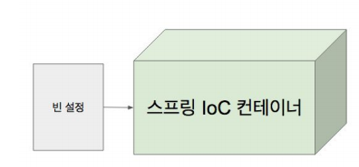

# [인프런 - 스프링 프레임워크 핵심 기술](https://www.inflearn.com/course/spring-framework_core/dashboard)를 보고 정리한 내용입니다

* [1. IoC 컨테이너 1부 : 스프링 IoC 컨테이너와 빈](#1-IoC-컨테이너-1부--스프링-IoC-컨테이너와-빈)
* [2. IoC 컨테이너 2부 : ApplicationContext와 다양한 빈 설정 방법](#2-IoC-컨테이너-2부--ApplicationContext와-다양한-빈-설정-방법)
* [3. IoC 컨테이너 3부 : @Autowired](#3-IoC-컨테이너-3부--@Autowired)
* [4. IoC 컨테이너 4부 : @Component와 컴포넌트 스캔](#4-IoC-컨테이너-4부--@Component와-컴포넌트-스캔)
* [5. IoC 컨테이너 5부 : Bean Scope](#5-IoC-컨테이너-5부--Bean-Scope)
* [6. IoC 컨테이너 6부 : Environment 1부 profile](#6-IoC-컨테이너-6부--Environment-1부-profile)
* [7. IoC 컨테이너 6부 : Environment 2부 property](#7-IoC-컨테이너-6부--Environment-2부-property)


## 1. IoC 컨테이너 1부 : 스프링 IoC 컨테이너와 빈

### 1-1. Ioc(Inversion of Control)

* IoC란 Inversion of Control의 약자로 의존 관계 주입(Dependency Injection)이라고도 한다.
* IoC는 어떤 객체가 사용하는 ​의존 객체를 직접 만들어 사용하는게 아니라, 어떠한 장치(생성자, Setter 등이 해당)를 통해 주입 받아 사용하는 방법​을 말한다

아래 코드에서 BookService 클래스는 BookRepository 클래스를 의존하는데 이때 new BookRepositiry(); 를 통해 의존 객체를 직접 생성하는 것이 아니라 생성자라는 장치를 통해 의존 객체를 통해 주입받고 있다.

```java
public class BookService {

    private BookRepository bookRepository;

    public BookService(BookRepository bookRepository) {
        this.bookRepositiry=bookRepositiry;
    }
  }
```

> Spring 4.3 이후는 단일 생성자에 한해 묵시적 생성자 주입을 지원한다.

### 1-2. 스프링 IoC 컨테이너

* 스프링 IoC 컨테이너란 IoC 기능을 스프링 프레임워크에 구현한 것이다. 스프링 IoC 컨테이너는 Bean 설정 파일로 부터 Bean 정의를 읽어들이고, Bean을 구성하고 제공하는 역할을 한다.
* 스프링 IoC 컨테이너라 불리는 이유는 IoC 기능을 제공하는 Bean들을 담고 있기 때문에 컨테이너라 불린다.

### 1-3. BeanFactory와 ApplicationContext

* BeanFactory는 스프링 IoC 컨테이너의 핵심 인터페이스로, Bean을 생성하고 관리하는 인터페이스 이다.
* ApplicationContext는 가장 자주 사용하는 인터페이스로 BeanFactory를 상속받으며 메시지 소스 처리 기능(i18n), 이벤트 발행 기능, 리소스 로딩 기능 들이 구현되어 있다.

### 1-4. Bean

스프링 컨테이너가 관리하는 객체를 Bean이라 부르며, Bean의 장점은 아래와 같다.

1. 의존성을 스프링 컨테이너가 관리해 준다.
2. Bean의 기본 Scope는 싱글톤 이기 때문에 런타임시 성능상 이점을 가진다.
3. Bean의 라이프 사이클을 활용하여 추가적인 작업이 가능하다.

## 2. IoC 컨테이너 2부 : ApplicationContext와 다양한 빈 설정 방법

 Spring IoC 컨테이너는 xml 또는 Java로 작성된 Bean 설정 파일을 읽어서 Bean을 스프링 IoC 컨테이너에 등록한다.



### 2-1. XML 설정파일

xml을 사용하여 Bean 설정을 정의한 설정파일이며, ApplicationContext를 통해 xml 설정파일을 읽어와서 Spring IoC 컨테이너에 Bean을 등록한다.


bookService와 bookRepository를 Bean으로 등록하며, setter 메소드를 통해 bookService에 있는 bookRepository를 주입 받을수 있도록 설정

```xml
<?xml version="1.0" encoding="UTF-8"?>
<beans xmlns="http://www.springframework.org/schema/beans"
       xmlns:xsi="http://www.w3.org/2001/XMLSchema-instance"
       xsi:schemaLocation="http://www.springframework.org/schema/beans
            http://www.springframework.org/schema/beans/spring-beans.xsd">

    <bean id="bookService" class="com.example.demo.BookService">
        <property name="bookRepository" ref="bookRepository"></property>
    </bean>

    <bean id="bookRepository" class="com.example.demo.BookRepository"></bean>

</beans>
```

ClassPathXmlApplicationContext을 사용하여 application.xml 파일에 있는 Bean 들을 등록한다.

> ClassPathXmlApplicationContext는 클래스패스에 있는 설정파일 위치를 파라미터로 받는다.

```java
@SpringBootApplication
public class DemoApplication {

    public static void main(String[] args) {
        ApplicationContext ctx = new ClassPathXmlApplicationContext("application.xml");
        String[] beanDeanDefinitionNames=ctx.getBeanDefinitionNames();
        System.out.println(Arrays.toString(beanDeanDefinitionNames));
    }
}
```

### 2-2. context:component-scan

* 위의 방법인 xml을 사용하여 Bean 설정파일 작성시, 설정 파일이 많아지면 설정 파일을 읽어오는 코드를 계속 추가해 줘야하는 번거로움 존재 한다. 이러한 문제를 해결하기 위해 등장한 방법이 context:component-scan 이다.
* context:component-scan은 스프링 2.5부터 등장하였으며, 지정한 패키지 부터 스캔하여 특정 어노테이션이 등록된 클래스를 Bean으로 등록한다. 특정 어노테이션은 @Component, @Service, @Repository, @Controller, @Configuration 이며, @Service, @Repository, @Controller, @Configuration 어노테이션은 @Component 어노테이션을 확장한 것이다.

com.example.demo 부터 scan을 시작해서 해당 어노테이션이 붙은 클래스를 모두 Bean으로 등록한다.

```xml
<?xml version="1.0" encoding="UTF-8"?>
<beans xmlns="http://www.springframework.org/schema/beans"
           xmlns:xsi="http://www.w3.org/2001/XMLSchema-instance"
           xmlns:context=" http://www.springframework.org/schema/context"
           xsi:schemaLocation="http://www.springframework.org/schema/beans">

 <context:component-scan base-package="com.example.demo"></context:component-scan>

</beans>
```

### 2-3. Java Config(자바 설정파일)

xml에 Bean 설정파일을 작성하는 것이 불편함에 따라 등장한 것이 Java 설정파일 이다.

Java 설정파일은 @Configuration을 사용하여 해당 클래스가 Bean 설정파일임을 지정하며, AnnotationConfigApplicationContext 클래스를 통해 Java 설정 파일을 읽어와 스프링 IoC 컨테이너에 등록한다.

```java
@Configuration
public class ApplicationConfig {
    @Bean
    public BookRepository bookRepository() {
        return new BookRepository();
    }

    @Bean
    public BookService bookService() {
        return new BookService();
    }
  }
```

```java
@SpringBootApplication
public class DemoApplication {

    public static void main(String[] args) {
        ApplicationContext ctx = new AnnotationConfigApplicationContext("ApplicationConfig.class");
        String[] beanDeanDefinitionNames=ctx.getBeanDefinitionNames();
        System.out.println(Arrays.toString(beanDeanDefinitionNames));
    }
}
```

### 2-4. @ComponentScan

* 위의 Java 설정방법도 xml 처럼 설정파일의 수가 증가시 설정파일들을 등록해줘야 하는 번거로움이 증가한다. 이러한 문제를 해결하기 위해 등장한 방법이 @ComponentScan이다.
* @ComponentScan은 지정한 패키지 또는 지정한 클래스가 위치한 곳 부터 스캔하여 @Component, @Service, @Repository, @Controller, @Configuration 어노테이션이 사용된 클래스를 Bean으로 등록한다.

```java
# basePackages 속성은 패키지를 기준으로 스캔한다.
@ComponentScan(basePackages="com.hong") 

# basePackageClasses 속성은 해당 클래스가 속한 패키지를 기준으로 스캔한다.
@ComponentScan(basePackageClasses=com.hong.SpringInitApplication.class)
```

> Spirng Boot에는 @SpringBootApplication에 @ComponentScan이 적용되어 있다.

## 3. IoC 컨테이너 3부 : @Autowired

스프링 IoC 컨테이너에 담겨있는 Bean의 타입(객체 타입)이 일치하는 것을 찾아서 일치하는 Bean(객체)을 자동으로 주입해주는 어노테이션 이다.

### 3-1. @Autowired를 사용할 수 있는 위치

@Autowired는 생성자, setter, field에서 사용가능 하다.

```java
public class BookService {

    private BookRepository bookRepositiry;

    // 생성자
    @Autowired
    public BookService(BookRepository bookRepositiry) {
        this.bookRepositiry=bookRepositiry;
     }
}
```

```java
public class BookService {

    private BookRepository bookRepositiry;

   // setter
   @Autowired
   public void setBookRepositiry(BookRepository bookRepositiry) {
        this.bookRepositiry = bookRepositiry;
   }
}
```

```java
public class BookService {

    // Field
    @Autowired
    private BookRepository bookRepositiry;
}
```

### 3-2. @Autowired의 required 속성

기본적으로 @Autowired 사용시 스프링 IoC 컨테이너에 해당 타입의 Bean 객체가 존재하지 않거나 또는 해당 타입의 Bean 객체가 2개 이상 존재시 예외를 발생 시키며, 애플리케이션 구동이 실패된다.

만약 위와 같은 경우가 발생해도 예외를 발생시키지 않고 애플리케이션을 구동할려면 @Autowired의 required 속성을 사용하면 된다. required 속성은 Boolean이며 기본값은 true이다. required 속성의 값이 false 일시 해당 Bean을 주입받지 못해도 예외가 발생되지 않고, 애플리케이션은 구동된다.

* 생성자에 @Autowired 사용시 required 속성은 무의미하다. 왜냐하면 생성자는 객체 생성시 필수 요소인데, 필요한 의존성을 주입받지 못하면 객체 생성을 할 수 없기 때문이다.

```java
public class BookService {

    private BookRepository bookRepositiry;

    // 생성자
    @Autowired(required=true)
    public BookService(BookRepository bookRepositiry) {
        this.bookRepositiry=bookRepositiry;
     }
}
```

```java
public class BookService {

    private BookRepository bookRepositiry;

   // setter
   @Autowired(required=false)
   public void setBookRepositiry(BookRepository bookRepositiry) {
        this.bookRepositiry = bookRepositiry;
   }
}
```

```java
public class BookService {

    // Field
    @Autowired(required=false)
    private BookRepository bookRepositiry;
}
```

### 3-3. @Primary와 @Qualifier

@Autowired 사용시 동일한 Type의 bean이 2개일 시 어떤 Bean을 주입받을지 선택해야 하는데, @Primary와 @Qualifier를 사용해서 주입받을 Bean을 지정할 수 있다.

#### 3-3-1. @Primary

@Componet와 @Bean 어노테이션이 사용된 곳에 붙일 수 있는 어노테이션으로, 동일한 타입의 Bean이 2개 이상일시 @Primary가 붙여진 Bean을 주입받는다.

Ioc 컨테이너에 BookRepository 타입의 Bean이 2개 이상일시 @Primary 어노테이션이 붙은 아래 빈을 주입 받는다.

```java
@Component
@Primary
public class BookRepository{}
```

#### 3-3-2. @Qualifier

@Autowired 어노테이션을 통해 의존 주입 받는 대상에 붙이는 어노테이션으로, 동일한 타입의 Bean이 2개 이상일시 Bean 객체 이름이 일치하는 것을 주입 받는다.

Bean의 타입이 BookRepository 이고, Bean의 이름이 BookRepository 인 것을 주입 받는다.

```java
public class BookService{
   @Autowired
   @Qualifier("BookRepository")
   private BookRepository bookRepository;
}
```

## 4. IoC 컨테이너 4부 : @Component와 컴포넌트 스캔

* @ComponentScan 어노테이션은 @Component, @Configuration, @Service, @Repository, @Controller 어노테이션이 사용된 Class를 Bean으로 등록해 주는 역할을 한다.

### 4-1. @ComponentScan

Spring 3.1부터 도입된 어노테이션으로 스프링 3.1부터 도입된 어노테이션으로 지정한 패키지 또는 지정한 클래스가 위치한 곳 부터 스캔하여 @Component, @Configuration, @Service, @Repository, @Controller 어노테이션이 등록된 클래스를 Bean으로 등록한다.

basePackages와 basePackageClasses 속성을 사용해서 스캔 위치를 지정할 수 있다.

#### 4-1-1. basePackages

지정된 패키지부터 스캔한다.

스캔 범위는 com.hong 패키지에 속한 모든 패키지를 스캔한다.

```java
@ComponentScan(basePackages="com.hong")
```

#### 4-1-2. basePackageClasses

해당 클래스가 등록되어 있는 패키지를 스캔하며, class를 사용하기 때문에 문자열을 사용하는 basePackages에 비해 타입 안정성을 보장한다.

```java
@ComponentScan(basePackageClasses=com.hong.SpringInitApplication.class)
```

### 4-2. @Filter

@ComponentScan에서 @Filter 어노테이션을 사용하여 특정 값에 따라 Bean으로 등록하지 않을 수도 있다.

> Filter Type 은 <https://www.baeldung.com/spring-componentscan-filter-type> 참고

```java
@ComponentScan(excludeFilters = {
   @Filter(type = FilterType.CUSTOM, classes = TypeExcludeFilter.class),
   @Filter(type = FilterType.CUSTOM, classes = AutoConfigurationExcludeFilter.class) })
```

## 5. IoC 컨테이너 5부 : Bean Scope

Bean의 Scope란 Bean 생성 범위를 뜻한다.

### 5-1. Scope의 종류

#### 5-1-1. Singleton

default Scope이며, 인스턴스가 오직 하나만 생성 된다.

#### 5-1-2. Prototype

Bean을 주입받을 때 마다 새로운 인스턴스가 생성 되서 주입받는다.

#### 5-1-3. 그 외

Request, Session, Websocket 이 있다.

### 5-2. Scope 지정하기

Bean을 선언하는 부분에 @Scope 어노테이션을 사용하여 해당 Bean의 Scope를 지정할 수 있다.

```java
@Component
@Scope(value="prototype")
public class prototype{}
```

### 5-3. Prototype Bean이 Singleton Bean을 참조하면?

Singleton은 인스턴스가 오직 하나만 생성되기 때문에 문제가 발생하지 않는다.

### 5-4. Singleton Bean이 Prototype Bean을 참조하면?

Singleton Bean은 ApplicationContext 초기 구동시 인스턴스가 생성되기 때문에 Prototype Bean에 변경사항이 생겨도 해당 변경사항이 업데이트 되지 않는 문제가 발생한다.

이러한 문제는 Prototype Bean을 proxy로 감싸므로써 해결할 수 있다. 아래의 그림처럼 Prototype Bean을 proxy로 감싸는 이유는 Singleton Bean이 Prototype Bean을 직접 참조하면 업데이트 되는 Prototype Bean을 사용할 수 없기 때문이다.


Prototype Bean을 proxy로 감싸는 방법은 @Scope의 proxyMode 속성을 사용하는 것이다.

ScopedProxyMode.XXX에서 XXX는 DEFAULT, TARGET_CLASS, INTERFACES, NO가 있다.

* 기본값은 DEFAULT이며, Proxy를 사용하지 않는다는 의미이다.
* TARGET_CLASS는 해당 bean을 클래스 기반 proxy로 감싼다는 의미이다.
* INTERFACES는 해당 bean을 인터페이스 기반 proxy로 감싼다는 의미이다.

```java
@Component 
@Scope(value="prototype", proxyMode=ScopedProxyMode.TARGET_CLASS) 
public class prototype{}
```

### 5-5.  Singleton 객체 사용시 주의할 점

1. Singleton 객체는 인스턴스가 하나만 생성되며 Property가 공유되기 때문에 Property의 값이 보장되지 않는다. 그렇기 때문에 Property 값 변경에 유의해야 한다.
2. ApplicationContext 초기 구동시 인스턴스가 생성되기 때문에 Application 구동시 시간이 걸릴수 있다.

## 6. IoC 컨테이너 6부 : Environment 1부. profile

### 6-1. Environment란

* `profile`과 `property`를 다루는 interface이다.
* Environment를 통해 **활성화 할 Profile**을 설정 할 수 있다.
* Environment를 통해 Application에 등록되는 **key:value 쌍으로 제공되는 property에 접근**할 수 있다.

### 6-2. Profile 이란

* 일반적으로 Profile이란 개발(dev), 테스트(test), 운영(prod) 등으로 구동환경을 세분화 하여 서비스를 관리하는 것으로, 이런 **식별 Keyword**를 `Profile`이라 한다.
* Spring에서 `profile`은 **Bean들의 묶음**이며, **환경에 따라 다른 Bean들을 사용해야 하는 경우에 사용**하며, 특정 Profile에 Bean을 등록하지 않는 이상 Default Profile에 등록된다.

### 6-2. Environment 사용하기

#### 6-2-1. Environment를 주입받아서 사용하기

Spring Boot 2.2.5 기준으로 Environment interface의 구현체로 StandardServletEnvironment를 주입받는다.

```java
@Component
public class Runner implements ApplicationRunner {

    @Autowired
    Environment environment;

    @Override
    public void run(ApplicationArguments args) throws Exception {
        System.out.println(Arrays.toString(environment.getActiveProfiles()));
        System.out.println(Arrays.toString(environment.getDefaultProfiles()));
    }
}
```

#### 6-2-2. ApplicationContext 사용하기

ApplicationContext는 EnvironmentCapable를 상속받으며, EnvironmentCapable의 getEnvironment() 메서드를 사용해서 Environment를 가져와서 Profile을 가져올 수 있다.
> 해당 방법도 결국에는 Environment interface를 가져오기 때문에 구현체로 StandardServletEnvironment를 사용한다.

```java
@Component
public class Runner implements ApplicationRunner {

    @Autowired
    ApplicationContext ctx;

    @Override
    public void run(ApplicationArguments args) throws Exception {
        Environment env = ctx.getEnvironment();
        System.out.println(Arrays.toString(env.getActiveProfiles()));
        System.out.println(Arrays.toString(env.getDefaultProfiles()));
    }
}
```

### 6-3. Profile 정의하기

`@Profile` 어노테이션을 사용해서 **특정 Profile에 Bean을 등록**할 수 있다. `@Profile`은 **클래스와 메소드에 사용가능하다.**

`ProfileService`는 현재 profile의 내용을 출력하기 위한 getProfile()를 메서드로 가지고 있으며, `DefaultProfileService`와 `DevProfileService`는 `ProfileService`를 상속받아서 현재 Profile을 출력해 주는 로직이다.

```java
public interface ProfileService {
    String getProfile();
}
```

`DefaultProfileService`는 **Profile이 default 일 때** bean으로 등록이 된다.

```java
@Component
public class DefaultProfileService implements ProfileService {

    @Override
    public String getProfile() {
        return "default profile 입니다.";
    }
}
```

`DevProfileService`는 **Profile이 dev 일 때** bean으로 등록이 된다.

```java
@Component
@Profile("dev")
public class DevProfileService implements ProfileService {

    @Override
    public String getProfile() {
        return "dev profile 입니다.";
    }
}
```

profile이 `default` 일 때는 **default profile 입니다.가 출력**될 것이며, `dev` 일 떄는 **dev profile 입니다.가 출력**된다.

```java
@Component
public class Runner implements ApplicationRunner {

    @Autowired
    ProfileService profileService;

    @Override
    public void run(ApplicationArguments args) throws Exception {
        System.out.println(profileService.getProfile());
    }
}
```

위에 방법에서 만약 `DefaultProfileService`의 Profile을 **dev**로 변경하고, `DevProfileService`의 Profile을 **default**로 변경한다면, 두 개의 클래스를 모두 수정해야한다. 예제에서는 클래스가 두 개밖에 안되지만 만약 개수가 많아진다면 실수할 확률도 높고 번거로우니 아래 방법인 **자바 설정파일을 만들어서 관리하는 것이 좋을 듯 하다.**

#### 6-3-1. Profile 정의시 method에 정의하기

```java
@Configuration
public class ProfileConfiguration {

    @Bean
    @Profile("default")
    public DefaultProfileService defaultProfileService(){
        return new DefaultProfileService();
    }

    @Bean
    @Profile("dev")
    public DevProfileService devProfileService(){
        return new DevProfileService();
    }
}
```

#### 6-3-2. Profile 정의시 class에 정의하기

```java
@Configuration
@Profile("default")
public class DefaultProfileConfiguration {

    @Bean
    public DefaultProfileService defaultProfileService(){
        return new DefaultProfileService();
    }
}
```

```java
@Configuration
@Profile("dev")
public class DevProfileConfiguration {

    @Bean
    public DevProfileService devProfileService(){
        return new DevProfileService();
    }
}
```

### 6-4. Profile Expression

Profile Expression을 사용하여 프로파일을 유연하게 지정할 수 있다.

* `!` (not) / `&` (and) / `|` (or)

아래 예제에는 !(not)을 사용했기 때문에 profile이 default가 아닐 때 bean으로 등록된다.

```java
@Configuration
@Profile("!default")
public class DefaultProfileConfiguration {

    @Bean
    public DefaultProfileService defaultProfileService(){
        return new DefaultProfileService();
    }
}
```

### 6-5. Profile 활성화 하기

* VM option(intelliJ) 또는 VM arguments(Eclipse)에 `-Dspring.profiles.acvtive=”프로파일명”`를 사용해서 지정할 수 있다.
* Spring Boot일 경우 Active profiles에 지정할 수 있다.


## 7. IoC 컨테이너 6부 : Environment 2부 property

### 7-1. Property란

모든 형태의 `key:value`를 의미한다. **.properties 파일**에 정의되어 있을 수도 있고, **환경 변수**에 저장되어 있을 수도 있고, **커맨드 라인 인자**로 전달되는 값일 수도 있다.

**즉, 여러 형태로 제공 되는 key:value를 의미한다.**

### 7-2. Property 우선순위

Environment를 통해 property에 접근시 **계층형으로 접근**한다. 계층형으로 접근하기 때문에 우선순위가 존재한다.

우선순위는 아래와 같다.

1. ServletConfig 매개변수
    * ServletConfig에 정의된 parameter는 해당 Servlet에서만 사용할 수 있다.
    * Spirng 에서는 DispathcerServlet에 의해 생성되는 WebApplicationContext property가 생성된다.
2. ServletContext 매개변수
    * ServletContext에 정의된 정의된 parameter는 동일 Web Application 내 모든 Servlet에서 사용할 수 있다.
    * Spring 에서는 ContextLoaderListener에 의해 생성되는 Root WebApplicationContext에 property가 생성된다.
3. JNDI(java:comp/env/)
4. JVM 시스템 프로퍼티(-Dkey=“value”)
5. JVM 시스템 환경 변수(운영 체제 환경 변수)

> ServletConfig와 ServletContext 둘 다 Servlet에 데이터를 전달하기 위해 사용되는 인터페이스이다.

### 7-2-1. application.properties 및 JVM 시스템 프로퍼티

name이란 key를 `ServletContext`와 `JVM 시스템 프로퍼티`에 정의 하였다.

```java
server.servlet.context-parameters.name=ServletContext
```


### 7-2-2. Runner

우선순위에 의해 `ServletContext`의 값인 **ServletContext**가 출력된다.

```java
@Component
public class Runner implements ApplicationRunner {

    @Autowired
    Environment environment;

    @Override
    public void run(ApplicationArguments args) throws Exception {
        System.out.println(environment.getProperty("name"));
    }
}
```

### 7-3. @PropertySource

* `@PropertySource`를 사용해서 `.properties` 파일을 읽어와 `Environment` 인터페이스를 사용해서 property를 가져올 수 있다.
* `@Configuration`가 사용된 곳에서 사용가능하다!

### 7-3-1. application.properties

```java
my.domain=jihun.dev
```

### 7-3-2. TestBean

```java
public class TestBean {

    private String name;

    public String getName() {
        return name;
    }

    public void setName(String name) {
        this.name = name;
    }
}
```

### 7-3-3. AppConfig

```java
@Configuration
@PropertySource("classpath:/application.properties")
public class AppConfig {

    @Autowired
    Environment environment;

    @Bean
    public TestBean testBean(){
        TestBean testBean = new TestBean();
        testBean.setName(environment.getProperty("my.domain"));
        return testBean;
    }
}
```

### 7-3-4. Runner

```java
@Component
public class Runner implements ApplicationRunner {

    @Autowired
    TestBean testBean;

    @Override
    public void run(ApplicationArguments args) throws Exception {
        System.out.println(testBean.getName());
    }
}
```
