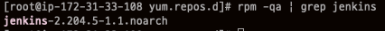
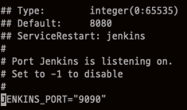

# CentOS7 에 Jenkins 설치

- 환경
  - CentOS 7
  - OpenJDK 1.8
  - 설치는 root 계정
- Jenkins 설치
  - stable version 설치
    - Jenkins stable version repo 추가
      - `wget -O /etc/yum.repos.d/jenkins.repo http://pkg.jenkins-ci.org/redhat-stable/jenkins.repo`
    - GPG Key 가져오기
      - `rpm --import https://jenkins-ci.org/redhat/jenkins-ci.org.key`
    - Jenkins 설치
      - `yum install jenkins`
    - Jenkins 설치 확인
      - `rpm -qa | grep jenkins`
      
  - Jenkins port 변경
    - Jenkins의 기본포트는 8080이며, Tomcat이 해당 포트를 사용하기 때문에 9090으로 변경하기
    - `vi /etc/sysconfig/jenkins`
    - JENKINS_PORT의 값을 9090으로 변경
    
  - 방화벽 설정 확인
    - 위에서 설정한 9090 포트가 방화벽에서 막을 수 있으므로 해제해줘야 함
    - AWS 사용시에는 AWS 방화벽에 inbound rule에 9090을 추가해 줘야 한다.
  - Jenkins Service 시작
    - `service jenkins start`
- Jenkins 시작
  - http://IP:9090에 접속
  - 초기 비밀번호는 `/var/lib/jenkins/secrets/initialAdminPassword` 에 있음